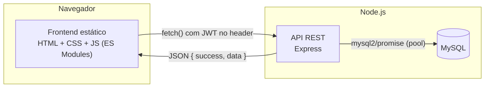
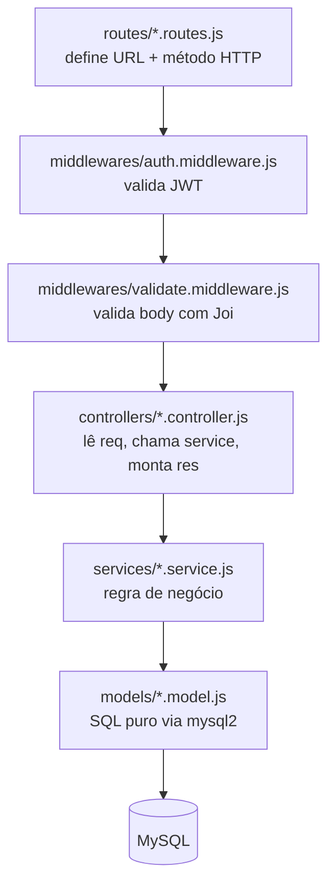
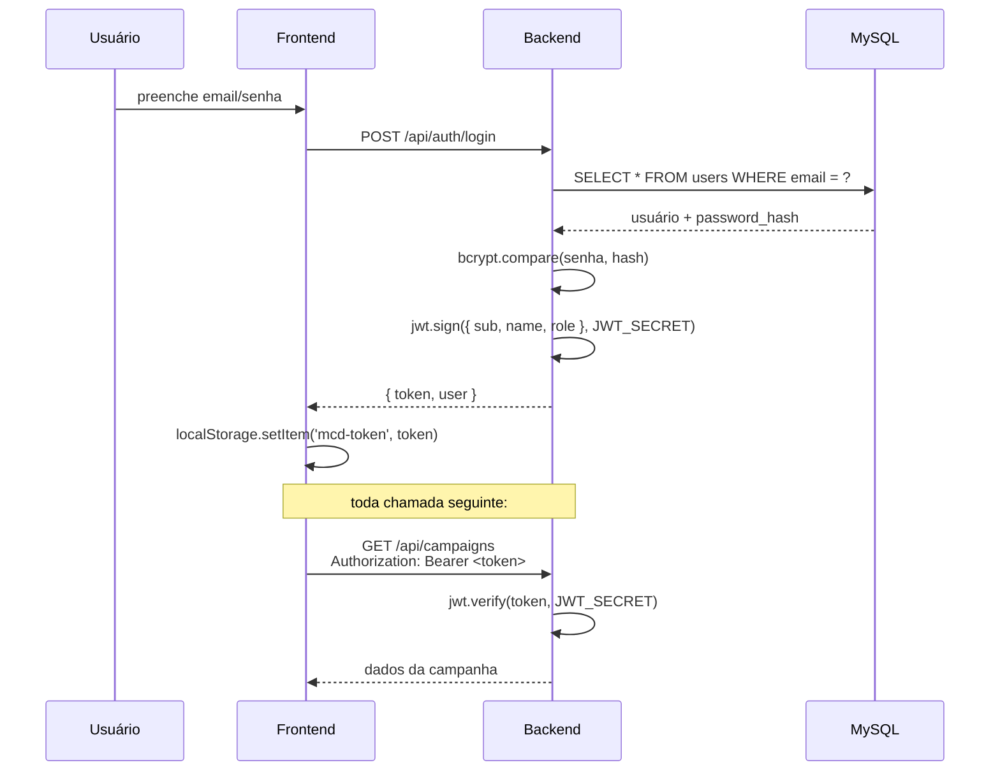

# Arquitetura do Sistema

> Como as peças se encaixam: camadas do backend, fluxo de dados, e por que cada decisão foi tomada. Leia isto antes de mexer no código — é o mapa da cidade.

## Visão geral

O frontend e o backend são **dois processos separados**, servidos por servidores HTTP diferentes (frontend por um servidor estático simples, backend pela API Express). Eles só se falam por HTTP/JSON. Essa separação é o que torna o projeto um "REST API + SPA-like frontend" em vez de um app monolítico com views renderizadas no servidor — decisão deliberada para parecer com a arquitetura de um SaaS real.

## Backend: arquitetura em camadas

Cada camada tem **uma única responsabilidade**, e a regra é: uma camada só conhece a camada imediatamente abaixo dela.

| Camada | Responsabilidade | Não faz |
|---|---|---|
| `routes/` | Mapear `método + caminho` para uma função de controller. Aplicar middlewares (auth, validação). | Nunca contém lógica de negócio. |
| `middlewares/` | Interceptar a requisição antes do controller: autenticação, validação de payload, tratamento de erro. | Não sabe nada sobre campanhas, clientes, etc — é genérico. |
| `controllers/` | Traduzir HTTP ↔ chamadas de função. Lê `req.params`/`req.body`, chama o service, devolve `res.json(...)`. | Não escreve SQL, não decide regra de negócio complexa. |
| `services/` | Regra de negócio: "ao editar uma campanha, comparar os campos e gravar histórico do que mudou". | Não sabe o que é `req`/`res` (poderia ser reusado fora de uma rota HTTP). |
| `models/` | Única camada que fala SQL. Cada função é uma query. | Não decide regra de negócio — só executa e devolve dados crus. |

### Por que separar assim (e não colocar tudo no controller)?

Porque cada camada pode ser testada e entendida isoladamente. Exemplo real deste projeto: o bug do histórico de auditoria falso-positivo (`budget: "1000.00"` vs `1000`) foi corrigido **só no `campaign.service.js`**, sem tocar em controller, rotas ou modelo — porque a regra "o que conta como mudança" mora inteira ali.

### Fluxo de uma requisição, passo a passo

Exemplo: `PUT /api/campaigns/5` (editar uma campanha).

1. **`routes/campaign.routes.js`** recebe a requisição, aplica `authMiddleware` (confere o JWT) e `validate(updateSchema)` (confere o formato do body com Joi).
2. **`controllers/campaign.controller.js#update`** extrai `req.params.id`, `req.body` e `req.user.sub` (o id do usuário logado, decodificado do token) e chama `campaignService.update(id, body, userId)`.
3. **`services/campaign.service.js#update`**:
   - Busca o estado atual da campanha (`campaignModel.findById`).
   - Compara campo a campo (`TRACKED_FIELDS`) o valor antigo com o novo, normalizando tipos (string vs número).
   - Monta o objeto "mesclado" (campos não enviados mantêm o valor antigo).
   - Chama `campaignModel.update` para persistir, e `historyModel.createMany` para gravar as mudanças detectadas.
4. **`models/campaign.model.js#update`** executa o `UPDATE` SQL puro via `mysql2`.
5. O controller devolve `{ success: true, data: campanhaAtualizada }` como JSON.

Se qualquer passo lançar um erro, ele sobe (via `asyncHandler`, que envolve toda função async de controller) até o **`error.middleware.js`**, que decide o formato da resposta de erro.

## Tratamento de erros: por que `ApiError` + `asyncHandler`

Express não captura automaticamente erros lançados dentro de `async function`s — se você não fizer nada, uma `Promise` rejeitada dentro de um controller trava a requisição (o cliente nunca recebe resposta). Duas peças resolvem isso:

- **`utils/asyncHandler.js`**: um wrapper que pega qualquer erro de uma função `async` e chama `next(err)`, entregando para o Express de forma correta.
- **`utils/ApiError.js`**: uma classe de erro com `statusCode` e `code` (ex: `404` + `CAMPAIGN_NOT_FOUND`). Qualquer lugar do backend pode fazer `throw ApiError.notFound(...)` e o middleware de erro sabe como transformar isso na resposta HTTP certa.
- **`middlewares/error.middleware.js`**: o último middleware da cadeia. Se o erro for um `ApiError`, devolve o `statusCode` e `code` dele. Se for qualquer outro erro (ex: uma exception inesperada do driver do MySQL), devolve `500` genérico — para nunca vazar detalhes internos (stack trace, texto de erro do banco) para o cliente.

## Autenticação: como o JWT circula

O token nunca é validado contra o banco depois do login — ele é **autocontido** (self-contained). O middleware `auth.middleware.js` só verifica a assinatura com `JWT_SECRET`; se for válida, confia no payload (`req.user = { sub, name, role }`). Isso é o que torna JWT "stateless": o servidor não guarda sessão em memória nem em banco.

## Frontend: por que sem framework

O frontend é vanilla JS com **ES Modules nativos do navegador** (`<script type="module">`, `import`/`export`) — sem bundler (Webpack/Vite), sem framework (React/Vue). Isso é intencional para este MVP:

- Prova que você entende o que frameworks abstraem por baixo dos panos (manipulação de DOM, roteamento simples, gerenciamento de estado local).
- Zero configuração de build — abrir com um servidor estático já funciona.
- Estrutura ainda assim organizada em módulos com responsabilidade única (ver tabela abaixo), para não virar "código espaguete".

| Pasta | Responsabilidade |
|---|---|
| `js/api/apiClient.js` | Único lugar que faz `fetch`. Centraliza header de autenticação, tratamento de erro HTTP e sessão expirada. |
| `js/components/` | Peças de UI reutilizáveis entre páginas: `layout.js` (sidebar/topbar), `modal.js`, `toast.js`, `charts.js`. |
| `js/pages/*.page.js` | Um arquivo por página HTML. Busca dados da API e manipula o DOM daquela página específica. |
| `js/utils/` | Funções puras sem efeito colateral: formatação de moeda/data, toggle de tema. |

Cada página HTML carrega **só o próprio módulo de página** (`<script type="module" src=".../dashboard.page.js">`), que por sua vez importa (`import`) só o que precisa dos outros módulos. O navegador resolve essas dependências sozinho — não existe "bundle" final, cada arquivo é servido e importado individualmente.

### Por que `campaigns.html` vira 404 se aberto direto com `file://`

Os módulos ES (`import`/`export`) só funcionam servidos via `http://` ou `https://` — o navegador bloqueia `import` em páginas abertas via `file://` por política de CORS. É por isso que o projeto **precisa** de um servidor estático mesmo sendo só HTML/CSS/JS (veja `frontend/serve.json` e a nota sobre `cleanUrls` no [README](../README.md)).

## Decisões técnicas e o porquê de cada uma

| Decisão | Alternativa óbvia | Por que essa e não a outra |
|---|---|---|
| Soft delete (`deleted_at`) em campanhas | `DELETE FROM campaigns` | Mantém o histórico de auditoria íntegro mesmo depois de "excluir" — e é reversível por um DBA em caso de erro. Todo `SELECT` de campanha filtra `deleted_at IS NULL`. |
| Histórico gravado por **diff no service**, não por trigger de banco | Trigger SQL `AFTER UPDATE` | Lógica de "o que conta como mudança" fica em JavaScript, testável com Jest, sem precisar de um banco rodando para testar a regra unitariamente. |
| Datas como `string 'AAAA-MM-DD'` nos validadores (não `Joi.date()`) | `Joi.date().iso()` | `Joi.date()` converte para um objeto `Date` do JS. Esse objeto, ao ser passado como parâmetro para o `mysql2`, é serializado usando o fuso horário local — e como o servidor roda em UTC-3, meia-noite UTC vira 21h do dia anterior, deslocando a data em -1 dia. Usando string, o valor nunca passa por essa conversão. **Isso foi um bug real encontrado e corrigido durante o desenvolvimento.** |
| Comparação numérica normalizada no diff de histórico | `String(a) !== String(b)` | Colunas `DECIMAL` do MySQL voltam como string (`"1000.00"`), enquanto o formulário envia número (`1000`). Comparar como string gerava entradas de histórico falsas a cada edição. **Também um bug real corrigido durante o desenvolvimento** — ver `services/campaign.service.js`. |
| Pool de conexões (`mysql2/promise` `createPool`) | Uma conexão única (`createConnection`) | Uma API com múltiplas requisições simultâneas não pode compartilhar uma única conexão MySQL (é single-threaded para queries). O pool gerencia várias conexões e as reaproveita. |
| JWT sem tabela de sessões no banco | Sessão em banco/Redis | Simplicidade para o MVP: qualquer instância da API consegue validar o token sozinha, sem consultar nada — bom o suficiente para um único servidor. Trade-off: não dá para "invalidar" um token antes de expirar sem uma lista de revogação (não implementada aqui). |

## Onde adicionar coisas novas (guia rápido para evoluir o projeto)

- **Novo campo em campanha** → `database/schema.sql` (coluna) → `campaign.validator.js` (regra) → `campaign.model.js` (incluir no `SELECT`/`INSERT`/`UPDATE`) → `campaigns.page.js` + `campaigns.html` (campo no formulário).
- **Novo endpoint** → criar função em `models/` → função em `services/` (se tiver regra de negócio) → função em `controllers/` → registrar em `routes/`.
- **Nova página no frontend** → arquivo `.html` em `public/` (copiar a estrutura de `campaigns.html`) → arquivo `.page.js` em `js/pages/` → adicionar item em `NAV_ITEMS` (`components/layout.js`).
- **Nova cor/token visual** → `frontend/src/css/tokens.css` (nunca cor "hardcoded" direto em `components.css`).

Para o roadmap de funcionalidades futuras (múltiplas plataformas por campanha, permissões, notificações, etc.), veja [PLANEJAMENTO.md](PLANEJAMENTO.md#9-funcionalidades-futuras-pós-mvp).
