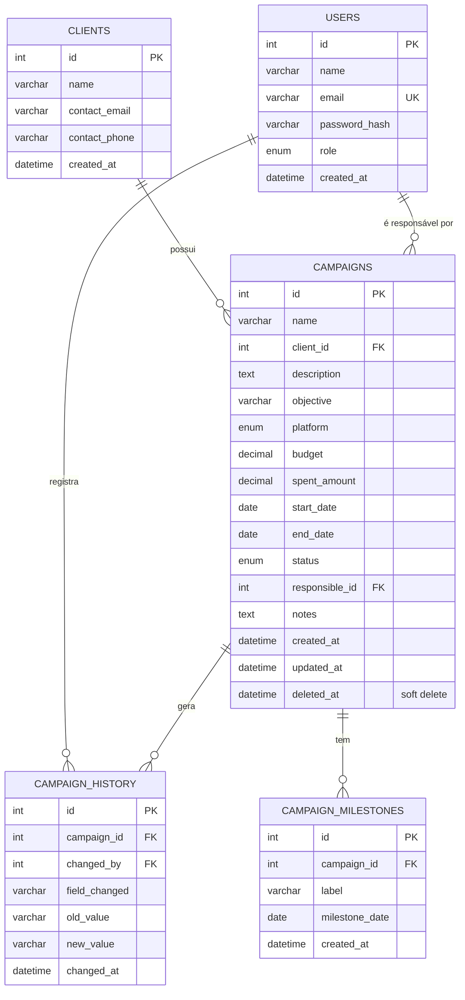

# Banco de Dados

> Referência completa do schema MySQL: tabelas, relacionamentos, índices e o raciocínio por trás de cada um. O SQL fonte da verdade está em [`backend/src/database/schema.sql`](../backend/src/database/schema.sql) — este documento explica o *porquê*, o arquivo `.sql` é o *o quê*.

## Diagrama Entidade-Relacionamento



## Tabelas, coluna a coluna

### `users`

Quem acessa o sistema e pode ser responsável por campanhas.

| Coluna | Tipo | Observação |
|---|---|---|
| `password_hash` | `VARCHAR(255)` | Nunca a senha em texto puro — hash gerado com `bcryptjs` (ver [GUIA_TECNICO.md](GUIA_TECNICO.md#bcrypt)). |
| `role` | `ENUM('admin','manager')` | Hoje não há checagem de permissão diferenciada por papel no código — a coluna existe para a evolução futura de "papéis e permissões" (ver [PLANEJAMENTO.md](PLANEJAMENTO.md#9-funcionalidades-futuras-pós-mvp)). |

### `clients`

O cliente da agência/freelancer — dono da campanha, não um usuário do sistema (não faz login).

### `campaigns`

Entidade central do produto.

| Coluna | Tipo | Observação |
|---|---|---|
| `platform` | `ENUM(...)` | Uma única plataforma por campanha no MVP. Se uma campanha precisar rodar em Instagram *e* Google Ads simultaneamente, hoje seriam duas campanhas. Migrar para M:N é a primeira entrada do roadmap futuro. |
| `budget`, `spent_amount` | `DECIMAL(12,2)` | `DECIMAL`, nunca `FLOAT`/`DOUBLE`, para dinheiro — ponto flutuante binário não representa exatamente valores decimais (`0.1 + 0.2 !== 0.3`), o que causaria diferenças de centavos ao somar orçamentos. O `mysql2` devolve `DECIMAL` como **string** (ex.: `"1000.00"`), não como `number` — isso importa, veja a nota de bug abaixo. |
| `status` | `ENUM('planned','active','paused','completed','cancelled')` | Uma máquina de estados simples. Não há hoje uma tabela de transições permitidas (ex.: impedir voltar de `completed` para `planned`) — é uma regra que poderia ser adicionada em `campaign.service.js` se o negócio precisar. |
| `deleted_at` | `DATETIME NULL` | Soft delete. Todo `SELECT` em `campaign.model.js` filtra `WHERE deleted_at IS NULL`. Ver [ARQUITETURA.md](ARQUITETURA.md#decisões-técnicas-e-o-porquê-de-cada-uma). |
| `updated_at` | `DATETIME ... ON UPDATE CURRENT_TIMESTAMP` | O próprio MySQL atualiza esse campo a cada `UPDATE`, sem precisar de código na aplicação. |

### `campaign_history`

O log de auditoria. Cada linha é **uma mudança de um campo específico**, não um snapshot da campanha inteira.

| Coluna | Observação |
|---|---|
| `field_changed` | Nome da coluna alterada (`status`, `budget`, `name`, `start_date`, `end_date`, `responsible_id`). |
| `old_value` / `new_value` | Sempre armazenados como `VARCHAR` — mesmo quando o campo original é numérico ou data — porque o histórico é só para exibição humana ("orçamento: 1000 → 2500"), nunca para cálculo. |
| `changed_by` | Quem fez a mudança (o usuário logado no momento do `PUT`), não necessariamente o `responsible_id` da campanha. |

Ao **criar** uma campanha, uma linha inicial é gravada (`field_changed = 'status'`, `old_value = NULL`, `new_value = 'planned'`) — é assim que a timeline sempre tem um ponto de partida.

### `campaign_milestones`

Datas importantes além de início/fim, usadas para enriquecer a linha do tempo na página de detalhe (ex.: "Aprovação do criativo"). Populado hoje só pelo seed; o endpoint `POST /campaigns/:id/milestones` existe para adicionar manualmente pela API (ainda sem UI dedicada no frontend).

## Relacionamentos e integridade referencial

- `campaigns.client_id → clients.id` e `campaigns.responsible_id → users.id`: `FOREIGN KEY` **sem** `ON DELETE CASCADE` — de propósito. Excluir um cliente ou usuário que tenha campanhas associadas deve falhar (o MySQL rejeita), forçando uma decisão explícita (reatribuir a campanha ou tratar o cliente como inativo) em vez de apagar campanhas em cascata silenciosamente.
- `campaign_history.campaign_id → campaigns.id` **com** `ON DELETE CASCADE`: aqui faz sentido — se uma campanha fosse fisicamente apagada, o histórico dela não tem razão de existir sozinho. (Na prática, campanhas usam soft delete, então isso quase nunca dispara.)
- `campaign_milestones.campaign_id → campaigns.id` **com** `ON DELETE CASCADE`: mesmo raciocínio.

## Índices

```sql
INDEX idx_campaign_status (status)
INDEX idx_campaign_dates (start_date, end_date)
```

Esses dois índices existem porque são exatamente os filtros mais usados pelas queries do dashboard (`getSummary`, `getStatusBreakdown`) e pela listagem (`findAll` com filtro de `status`). Sem índice, cada uma dessas queries faria um *full table scan* — irrelevante com 30 linhas de seed, mas o hábito de indexar colunas usadas em `WHERE`/`GROUP BY` é o que evita que a aplicação fique lenta quando o volume de dados crescer.

## Uma pegadinha do driver que virou bug real (e o que aprender com ela)

Durante os testes end-to-end deste projeto, duas datas erradas apareceram na tela (um dia a menos do que o digitado). Causa raiz:

1. O validador (`Joi.date().iso()`) transformava a string `"2026-08-10"` em um objeto `Date` do JavaScript, representando `2026-08-10T00:00:00.000Z` (meia-noite **UTC**).
2. O `mysql2` recebeu esse objeto `Date` como parâmetro de uma coluna `DATE` e o serializou usando o fuso horário **local** do processo Node (UTC-3, no caso).
3. Meia-noite UTC, convertida para UTC-3, é 21h do dia anterior — e o MySQL truncou isso para a data `2026-08-09`.

**A correção:** parar de converter para `Date` e manter a data como string (`Joi.string().pattern(/^\d{4}-\d{2}-\d{2}$/)`) do formulário até o banco. Sem objeto `Date` no meio do caminho, não existe conversão de fuso horário para dar errado.

Essa é uma classe de bug clássica em qualquer stack que mistura "datas sem hora" (como um orçamento de campanha, que não tem uma hora do dia associada) com tipos que **sempre** carregam fuso horário (como `Date` do JS). A regra prática: se o conceito de negócio é "um dia", trate como string; só use `Date`/`Timestamp` quando o momento exato (hora, minuto, segundo) importar.

## Como aplicar o schema e popular dados de teste

```bash
cd backend
npm run db:schema   # roda src/database/schema.sql contra o MySQL configurado em .env
npm run db:seed     # popula com 3 usuários, 8 clientes, 30 campanhas (via @faker-js/faker)
```

O script de seed (`backend/src/database/seeds/seed.js`) trunca as tabelas antes de popular — rodar `db:seed` de novo sempre te devolve a um estado limpo e conhecido, útil para testar sem acumular lixo de dados manuais.
